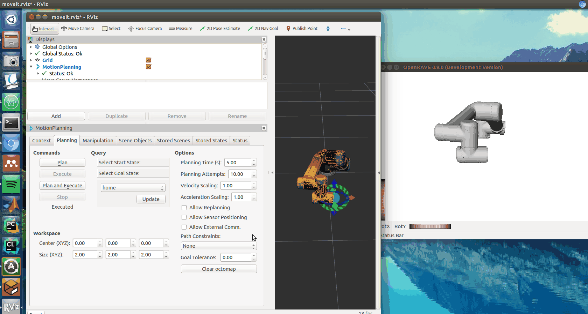

# UR5 Controller for OpenRAVE



This controller will listen to ROS topic that publishes the joints of UR5 in real time. Will allow visualising the current state
of a UR5 in OpenRAVE either from a real, physical, robot or through a simulation like MoveIt!.

## Includes
This repository includes the following:
- The custom written controller for OpenRAVE and UR5 robot.
- The URDF and SRDF files to load UR5 model into

## Other dependencies
```bash
sudo apt-get install ros-indigo-universal-robot
```

## Preparation
- Create a new directory called `rosmake_ws` in your home directory. `mkdir ~/rosmake_ws`
- Add the following line in your `~/.bashrc` file located under your home directory by running the following command in the terminal: `echo 'export ROS_PACKAGE_PATH=$ROS_PACKAGE_PATH:~/rosmake_ws' >> ~/.bashrc`
- Run `source ~/.bashrc`.
- You need to install and configure another OpenRAVE plugin called `or_urdf` this plugin is available [here](https://github.com/personalrobotics/or_urdf). I have written a blog post on 
how to install this plugin if you struggle to find a solution, find the tutorial [here](http://computingstories.com/robotics%20stories/installing-or_urdf-openrave-plugin.html).
- You need to install a dummy ROS OpenRAVE package that creates links for the OpenRAVE installation so ROS is aware of the
path of the OpenRAVE software. You can download and install this dummy package from [here](https://github.com/papallas/openrave). Instructions on how to configure this dummy ROS OpenRAVE
pacakge see the relevant installation instructions in the README file in that repository.

## How to install
1. Clone this repository and build:
   ```bash
   cd ~/rosmake_ws
   git clone git@github.com:papallas/ur5controller.git
   cd ur5controller 
   rosmake
   ```
You should see a compile process taking place and at the end a message saying the successful and failed builds. You should have 0 failed in which case everything works perfectly. If you do get failures review the error and try to solve the problem.

2. Let OpenRAVE know about your new plugin
- Add another line at the end of your `.bashrc` file located under your home directory by running the following line in your terminal: `echo 'export OPENRAVE_PLUGINS=$OPENRAVE_PLUGINS:~/rosmake_ws/ur5controller/lib' >> ~/.bashrc`
- Run `source ~/.bashrc`.
- Verify that the controller is successfully installed by running `openrave --listplugins` you should see `URDF` under module and `Ur5Controller` under controllers.

3. Once everything is successful with the above process you need to generate the `.urdf` file. I have created a handy Python script that will make this process easy for you.
- In `ur5controller` directory located in `rosmake_ws` you should have a directory called `ur5_model` and within this directory, you should have a Python file called `urdf_file_generator.py`.
- `cd ~/rosmake_ws/ur5controller/ur5_model`
- Run the Python script `urdf_file_generator.py` and if you are happy having the meshes and the URDF and SRDF files under
`~/rosmake_ws/ur5controller/ur5_model` then proceed and hit enter without providing a path input. If however, you
prefer having those files into a different location go ahead and move them into another directory and run the Python script
within this new directory.
- Once you run it a `ur5.urdf` file should be generated containing all the information needed with the hard-coded URI paths
that the Python script have created for you.

# Testing the controller
There is a file called `test_ur5.py` that you can run and test the controller:

```python
from openravepy import *
import numpy
import os

env = Environment()
env.SetViewer('qtcoin')
module = RaveCreateModule(env, 'urdf')

with env:
    # Get the path of SRDF and URDF from the current working directory.
    current_working_directory = os.getcwd()
    srdf_path = current_working_directory + "/ur5_model/ur5.srdf"
    urdf_path = current_working_directory + "/ur5_model/ur5.urdf"

    name = module.SendCommand('LoadURI {} {}'.format(urdf_path, srdf_path))
    robot = env.GetRobot(name)

# Add the robot to the environment
env.Add(robot,True)

# this binds UR5 controller to the robot
probotcontroller = RaveCreateController(env,'ur5controller')
robot.SetController(probotcontroller)
```

# Trajectory Execution
Another important functionality of this plugin is that is able to execute trajectories generated by OpenRAVE planners on the real robot (or on a UR5 Simulator like Gazebo).

There is a test program that demonstrates this functionality under [`test_ur5`](test_ur5.py) in which case will load UR5 in OpenRAVE and then do a simple trajectory execution.

# Contributors
UR5 OpenRAVE controller was developed by the Robotics Lab in the School of Computing at the University of Leeds. This software is developed and maintained by [Rafael Papallas](https://github.com/papallas)

