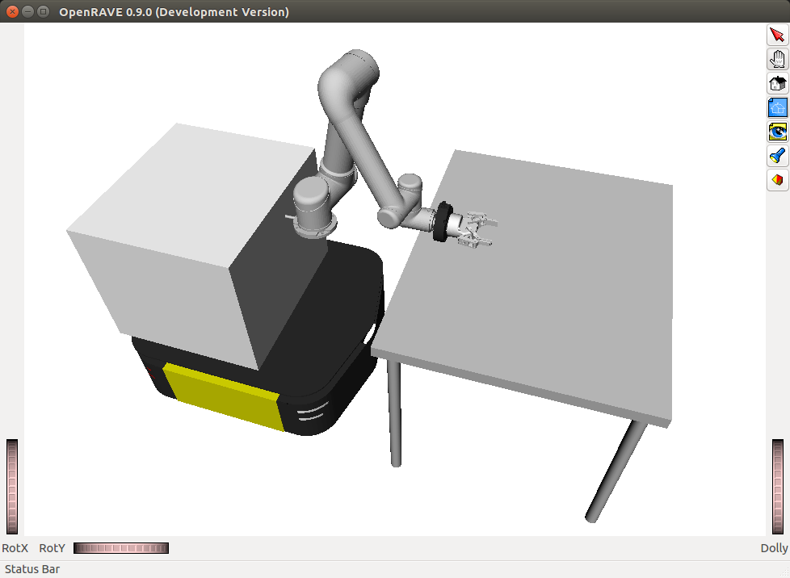

## Developers and Contributors
UR5 OpenRAVE controller was developed by the Robotics Lab in the School of Computing at the University of Leeds. 
- Author: [Rafael Papallas](https://github.com/papallas).
- Current maintainor: [Rafael Papallas](https://github.com/papallas).

## License
UR5 OpenRAVE controller is licensed under GNU General Public License v3.0. The full license is available [here](https://github.com/roboticsleeds/ur5controller/blob/master/LICENSE). 

## UR5 Controller for OpenRAVE



This controller will listen to ROS topic that publishes the joint values of the 
UR5 robot in real time and will visualise the current state of a UR5 robot in OpenRAVE.

Another important functionality of this plugin is that is able to execute trajectories 
generated by OpenRAVE planners on the real robot.

There is a test program that demonstrates this functionality under 
[`scripts/control_ur5`](scripts/control_ur5.py) in which case will load UR5 in 
OpenRAVE and then let you control the UR5 robot above a table (move left, right, 
forward, backwards and rotate the gripper clockwise and anti-clockwise).

## Includes
This repository includes the following:
- The custom written controller for OpenRAVE and UR5 robot.
- The URDF and SRDF files for UR5 itself, Robotiq Two-Finger Gripper, and 
Clearpath Ridgeback moving base.

## Dependencies
- [ur_modern_driver](https://github.com/ThomasTimm/ur_modern_driver) needs to be installed on the computer that controls the robot and you need to run `roslaunch ur_modern_driver ur5_bringup.launch robot_ip:=THE_IP_OF_UR5_ROBOT`.
- You need to install the [openrave_catkin](https://github.com/personalrobotics/openrave_catkin).
- You need to install and configure another OpenRAVE plugin called `or_urdf` this plugin is available [here](https://github.com/personalrobotics/or_urdf). I have written a blog post on 
how to install this plugin if you struggle to find a solution, find the tutorial [here](http://computingstories.com/robotics%20stories/installing-or_urdf-openrave-plugin.html).
- **(OPTIONAL)** Install the Robotiq controller.
  1. `cd ~/catkin/src`
  2. `git clone git@github.com:ros-industrial/robotiq.git`
  3. `cd robotiq`
  4. `git checkout indigo-devel`
  5. `rosdep install robotiq_modbus_tcp`
  6. `sudo apt-get install ros-indigo-soem`
  7. `cd ~/catkin_ws`
  8. `catkin_make`

## Installation
- Go to your catkin worksapce e.g `cd ~/catkin_ws/src` and clone this repository: `git clone git@github.com:papallas/ur5controller.git`
- Add the following line in your `~/.bashrc` file located under your home 
directory by running the following command in the terminal: `echo 
'export OPENRAVE_PLUGINS=$OPENRAVE_PLUGINS:~/catkin_ws/devel/share/openrave-0.9/plugins' >> ~/.bashrc`
- Run `source ~/.bashrc`.
- Go to your catkin workspace `cd ~/catkin_ws` and run `catkin_make`. You should 
see a successful message on build in which case you are ready to go. If you get 
any errors at this stage, please review what went wrong.
- Add in your `.bashrc` the Python path to the UR5 class by running 
```bash
echo 'export PYTHONPATH=$PYTHONPATH:~/catkin_ws/src/ur5controller/pythonsrc/ur5_robot' >> ~/.bashrc`
```
This will let Python know where the Python classes for 
creating UR5 robot instances in OpenRAVE are.

## Testing the controller
There is a file called `control_ur5.py` under `scripts` that you can run and 
test the controller on the real robot.

With the Python class in place, creating a UR5 robot in OpenRAVE is super easy:

```python
from ur5_factory import UR5_Factory
ur5_factory = UR5_Factory()

# If you want to specify all the configuration settings (is_simulation, has_ridgeback etc)
env, robot = ur5_factory.initialize_ur5_with_configuration(is_simulation=True,
                                                           has_ridgeback=True,
                                                           gripper_name="robotiq_two_finger",
                                                           has_force_torque_sensor=True,
                                                           env_path="test_env.xml",
                                                           viewer_name="qtcoin",
                                                           urdf_path="package://ur5controller/ur5_description/urdf/",
                                                           srdf_path="package://ur5controller/ur5_description/srdf/")

# The above is equivalent to the following (the initialize_ur5_with_configuration has set to defaults the values used above):
env, robot = ur5_factory.initialize_ur5_with_configuration()
```

## Controller explained
1. Load the robot in OpenRAVE using the URDF plugin:
```python
env = Environment()
env.Load('test_env.xml')
env.SetViewer('qtcoin')

urdf_path = "package://ur5controller/ur5_description/ur5.urdf"
srdf_path = "package://ur5controller/ur5_description/ur5.srdf"

module = RaveCreateModule(env, 'urdf')
with env:
  name = module.SendCommand('LoadURI {} {}'.format(urdf_path, srdf_path))
  robot = env.GetRobot(name)

env.Add(robot, True)
```
2. You now need to attach the controllers (UR5 and the Robotiq controllers) to
the robot using the `MultiController`:
```python
multicontroller = RaveCreateMultiController(env, "")
robot.SetController(multicontroller)

robot_controller = RaveCreateController(env,'ur5controller')
hand_controller = RaveCreateController(env, 'robotiqcontroller')

multicontroller.AttachController(robot_controller, [2, 1, 0, 4, 5, 6], 0)
multicontroller.AttachController(hand_controller, [3], 0)
```

You are now set. The OpenRAVE robot should update as you change the configuration
of the actual robot, and should also execute trajectories from OpenRAVE to 
the actual robot.

## Other Notes
- The package will check (in ur5_factory.py) if certain topics are being published
(i.e `CModelRobotInput` and `CModelRobotOutput`) if you chose a gripper name 
equal to "robotiq_two_finger_" and will not attach the corresponding controller
if those topics are not being published. This is a defensive mechanism to avoid
`IsDone()` method of the end-effector gripper returning false and blocking the
program execution. For more discussion, see [here](https://stackoverflow.com/questions/49552755/openrave-controllerbase-is-blocking-at-the-isdone-method-and-never-returns/49552756#49552756)
